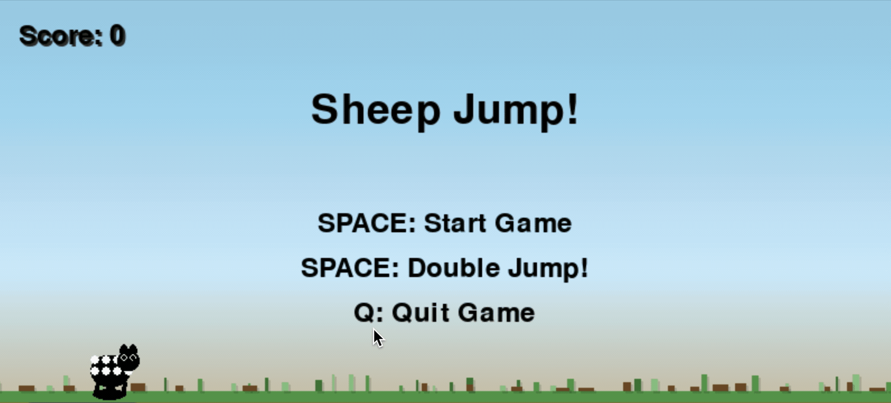
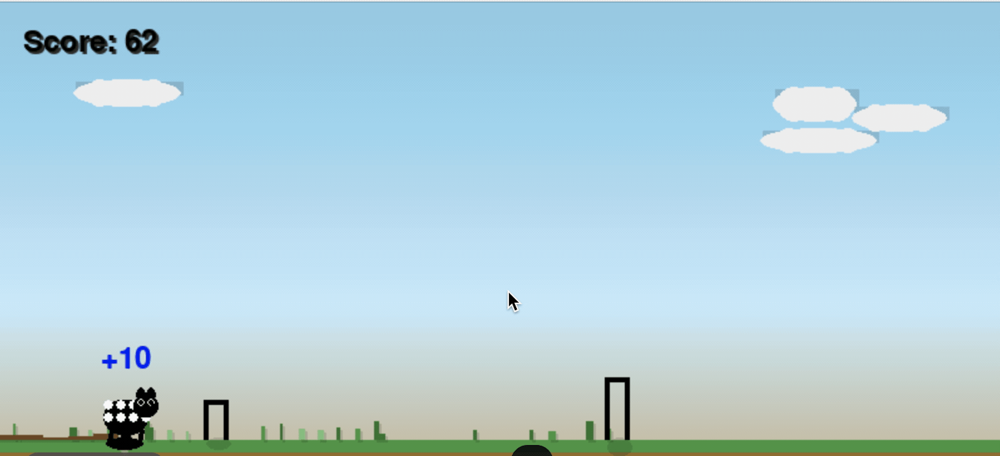

# Sheep Jump Game

A simple Chrome dinosaur-style game built with Python and Pygame.





## Setup

1. Install the required dependencies:
```bash
pip install -r requirements.txt
```

## How to Play

1. Run the game:
```bash
python main.py
```

2. Controls:
- Start Menu:
  - SPACE: Start game
  - Q: Quit game
- In Game:
  - SPACE: Jump
  - P: Pause/Resume
  - Q: Return to menu
- Game Over:
  - SPACE: Restart game

## Features

- Start menu with high score display
- Simple and responsive controls
- Gradually increasing difficulty with speed cap
- Pause functionality
- High score tracking
- Clean collision detection
- Visual enhancements including grass ground, clouds, and shadows
- Scoring system with points for both jumps and survival time

