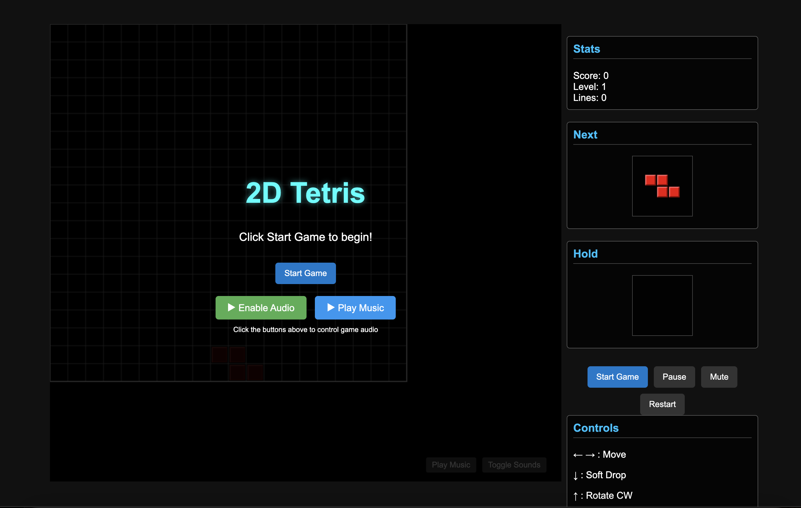

# 2D Tetris Game

A modern implementation of the classic Tetris game built with HTML5, CSS, and JavaScript with immersive sound effects.



## Play Online

You can play the game directly on GitHub Pages:
[Play Tetris](https://yourusername.github.io/tetris)

## Table of Contents
- [Overview](#overview)
- [How to Play](#how-to-play)
- [Game Controls](#game-controls)
- [Features](#features)
- [Setup Instructions](#setup-instructions)
- [Deploying to GitHub Pages](#deploying-to-github-pages)
- [Technical Details](#technical-details)

## Overview

This is a fully-featured 2D Tetris game that offers classic gameplay with modern visuals and audio effects. The goal is to complete lines by moving and rotating falling tetrominoes (geometric shapes made of four squares) to create horizontal lines that clear from the game board.

## How to Play

1. **Start the Game**: Click the "Start Game" button on the start screen or in the sidebar controls.
2. **Control Falling Pieces**: Use the controls to move, rotate, and drop the falling tetromino pieces.
3. **Complete Lines**: Fill an entire horizontal line to make it clear from the game board and earn points.
4. **Level Up**: As you clear more lines, the game speed increases, making it more challenging.
5. **Avoid Overflow**: The game ends when the stack of tetromino pieces reaches the top of the play field.

### Scoring System
- **Single Line Clear**: 100 points × current level
- **Double Line Clear**: 300 points × current level
- **Triple Line Clear**: 500 points × current level
- **Tetris (Four Lines)**: 800 points × current level

## Game Controls

### Keyboard Controls
- **Left Arrow**: Move tetromino left
- **Right Arrow**: Move tetromino right
- **Down Arrow**: Soft drop (move down faster)
- **Up Arrow**: Rotate clockwise
- **Z Key**: Rotate counter-clockwise
- **Space Bar**: Hard drop (instantly drop to the bottom)
- **C Key**: Hold current piece for later use

### Touch Controls (Mobile)
- **Left Button (←)**: Move tetromino left
- **Right Button (→)**: Move tetromino right
- **Down Button (↓)**: Soft drop
- **Rotate Button (↻)**: Rotate tetromino
- **Hold Button (H)**: Hold current piece
- **Hard Drop Button (⤓)**: Instantly drop to the bottom

## Features

- **Ghost Piece**: Shows where the current tetromino will land
- **Next Piece Preview**: Displays the upcoming tetromino
- **Hold Piece**: Store a tetromino for later use
- **Level System**: Game speed increases as you clear more lines
- **Sound Effects**: Dynamic audio feedback for game actions including:
  - Different sounds for single, double, triple, and tetris line clears
  - Movement, rotation, drop, lock, and hold sounds
  - Level up and game over sounds
- **Responsive Design**: Optimized for various screen sizes
- **Particle Effects**: Visual flourishes for line clears and other actions

## Setup Instructions

### Local Development

1. **Clone the Repository**
   ```
   git clone https://github.com/sumanentc/VibePlayground.git
   cd VibePlayground/tetris
   ```

2. **Run a Local Server**
   
   You can use Python's built-in HTTP server:
   ```
   python -m http.server 8000
   ```
   
   Or any other local development server of your choice.

3. **Open in Browser**
   
   Visit `http://localhost:8000` in your web browser.

## Technical Details

This Tetris implementation is structured with a modular design that separates concerns into different components:

- **Game Logic**: Managed by `GameManager` class
- **Rendering**: Handled by `Renderer` class using HTML5 Canvas
- **Audio**: Controlled by `AudioManager` class using Howler.js
- **Sound Generation**: Custom sound effects generated programmatically with `generate_sounds.js`
- **User Interface**: Managed by `UIManager` class
- **Visual Effects**: Implemented through `ParticleSystem` class

The game uses a main loop to update the game state, handle user input, and render the game board and pieces.

---
